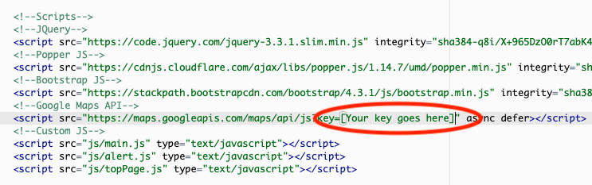

# iDest #
## Interactive Front-end Web Development Project ##

## Aim ##

The aim of this project was to create and build a Single-Page-Application (SPA) interactive front-end website using Google 
Maps API [iDest](https://anthonynicklin.github.io/ms2-idest/). The SPA would allow users to search for their next holiday destination and 
help users find attractions, hotels, bars and restaurants.

## UX ##

Starting with a mobile first design approach to this project I started creating mockups and wireframes for mobile and small screens. I then moved onto creating mockups 
and wireframes for medium and larger screens. The design of the site is modern, image rich, and easy to navigate and use. 

Below are user stories that were conducted in order to gain clear goals that needed to be achieved for this website.
1. I want to chose the country and city where my city break will be.
2. I want a map to center on the city I select.
3. I want the map to show me points of interest POI like bars, restaurants, attractions and hotels.
4. I want to be able to use this on different sized screens.
5. I want to be able to control the map.
6. With a click or tap have more information displayed about the POI.
7. I would like a form I can fill in in order to contact someone to discuss my break and book a trip.

The navigation bar is responsive having break points for smaller, medium and large screens. The navigation links disapear on screen width's below 992 pixals and a burger menu icon appears 
top left. When the burger icon is clicked, it brings a drop down menu with the navigation links displayed vertically down the left-hand side. The logo is visalble on medium to larger
screens in order to reduce the size of the navigation bar on small screens. There is a fixed "to the top button" that appears when the user starts to scroll down the page to provide
ease of navigation at all time.

The [landing](https://anthonynicklin.github.io/ms2-idest/index.html) and [about](https://anthonynicklin.github.io/ms2-idest/index.html#about) sections combined make a visualy appealing
start to the users experience. Designed to give the user a simple message to explore and explain what the web application is here to do. The [about](https://anthonynicklin.github.io/ms2-idest/index.html#about)
has a carousel of images of POIs. The carousel is interactive with buttons on the botton and on each side the user can click to select of go back and foruth through the images. Each image
has a small inspirational message at the botton.

'Find your spot' is the message the user first sees on the [find](https://anthonynicklin.github.io/ms2-idest/index.html#find) section to encourage them to use the app. Simple instructions are written 
to ensure there is no confusion on how to user the app itself. The country dropdown menu already has some pre-populate countries and also a 'All' option incase the country they wish to view is not listed.
The input for the city destination uses Google Maps autocomplete function speeding up the process and also providing better useability on tounch screens as it can save further typing. The four POI buttons
once tappedor click set the application off bringing back the results. The results for smaller screens are just displayed on the map with markers. Details of the POI can be display by tapping or clicking
on the marker itself which presents a neat info window. I kept to just the map on smaller screens as displaying the results in another context on the same page would clutter the page. Medium and larger screens
have results also displayed as cards vertically along side the map. When the user clicks on the card the info window is dispalyed above the marker on the map so they can see POI location on the map. 

The [booking](https://anthonynicklin.github.io/ms2-idest/index.html#book) section provide a easy to use contact form that send the users infomation via email in order for someone to contact them back 
to discuss future trip. An image was use behind the contact form in order make the form more appealing. Once the form is submitting a modal is displayed thanking them.

During the process of designing this SPA, finding images and icons that visualy went together was difficult and time consuming. 

## Features ##

Features on this website are:

* The links in the navigation when hovered over turn black to indicate which link the users cursor is over.
* When hovering over any links the cursor changes from a pointer to a hand.
* The carousel in the [about](https://anthonynicklin.github.io/ms2-idest/index.html#about) section has interactive buttons at the
    to select the images.
* The country input field has a autocomplete function to aide the user in selecting/finding the city they which to visit.
* Markers on the map when clicked or tapped bring up an info window with details information about that POI.
* The results cards are like to the map and when clicke or tapped will bring up its respected info window for additional information
* The booking form uses Bootstrap4 input validation to check values before they are submitted.
* The booking form sends the information to an email using emailJS in order for the user to be contacted back.
* A successful form submittion will dispaly a modal with a thank you message.
* The modal can be close using  the close cross, close button, or by clicking anywhere outside the modal.

Future features
* Travel blog describing experiences in different cities around the world.
* Price checker for flights and hotels.
* User accounts so searchs can be saved.

## Technologies Used ##

Below are a list of the programming languages, technologies and frameworks used for this website.

* HTML5
* CSS3
* SASS
* JavaScritpt
* JQuery
* EmailJS
    * For sending the booking form vaules entered to an email address. 
* Markdown
    * Used to write the README.md file.
* [Bootstrap4.3.1 framework](https://getbootstrap.com/)
    * The website uses boostrap framework for it's grid system, pagelayout, button styling and responsive navigation bar.
* [Cloud9IDE](https://aws.amazon.com/cloud9/)
    * Cloud9 was the IDE used to write the code for this website.
* [MarvelApp](https://marvelapp.com)
    * This was used to design and create the wireframes for this project.
* [Google Fonts](https://fonts.google.com/)
* Git
    * Version control
* [Github](https://github.com)
* [Font Awesome](https://fontawesome.com/)
    * For social media icons and Glyphicons
* Google Chrome Developer Tools
* Firefox Inspector
* Safari

## Testing ##

I conducted testing across different platforms and web browsers in order to make sure the website worked correctly, and
looked great across each one. I also asked friends and family to test across their own devices and to give me honest opinons and feedback.

Platforms:
* Samsung Galaxy 8
    * Google Chrome
    * Firefox
    * Samsung web browser
* iPad Mini
    * Safari
* MacBook Pro
    * Google Chrome
    * Firefox
    * Safari
* Ubuntu 18.0
    * Google Chrome
    * Firefox
* Windows 10
    * Google Chrome
    * Firefox
    * Mircosoft Edge
    * IE 11

Manual testing was conducted to ensure the user story objectives where achieved.
1. Country
    * 'All' selected as the country and checked autocomplete shows cities from different countries.
    * Select each country and check autocomplete shows cities from the respected country.
    * When the country and city have been selected the map centers and zooms in on that city.
2. POIs
    * Click on 'Find' in navbar.
    * When clicked each POI button dispalys the correct POIs repectivly. 
    ..When 'All' and no city is selected.
    ..When a country and city is selected.
    * Results from the last search are cleared before the next search results are dispalyed.
    * Markers are cleared on the map before the next markers are displayed.
3. Web application works across different device types
    * Load website on different device types and perform all testing that has been stated above.
4. Booking form
    * Use navigation link to "Book" section.
    * Try to submit the empty form and verify that an error message about the required fields appears.
    * Try to submit the form with an invalid email address and verify that a relevant error message appears.
    * Try to submit the form with an invalid telephone number and verify that a relevant error message appears.
    * Try to submit the form with all inputs valid. Modal should be displayed with thank you message.
5. Map
    * Contorls are shown on the map.
    * Drag the map around in all directions.
    * Zoom in and out of the map.
    * Switch between Map and Satellite views.
    * Click on a marker to display more information.
    * Click on a results card and display more information above the marker on the map.
6. Booking Form
    * Required fields must be filled in.
    * Name field only excepts characters.
    * Email field only excepts the format 'example@domain.com'.
    * Telephone field only excepts numbers.
    * On successful submission modal is dispalyed with thank you message.
    * Modal can be closed by clicking on any part of the windown outside the modal.
    * Modal can be closed using the closed button or the cross button.

On Internet Explorer the position property 'sticky' was causing the map to be dispalyed 5.5em down from the top. The the CSS value top: 5.5em
is there to move the map down enough so the sticky navigation bar does not hide it when the user scrolls down. On IE, the browser was applying this
regardless if the user had scrolled down the page. In order for IE browser to display top: 0, I had to add some CSS to target IE only. This issue
also highlighted the fact that IE does not support the position property 'sticky' at this time of writing. I have only be able to test this on IE 11
so far.

The map would failed to load randomly, occuring once every 10 times or so. The console would print a *'InitMap is not a function'*. I believe this
was caused due to the loading order of the scripts in my index.html file. The Google Maps API script was set to load first, then main.js that actually held the initMap function. 
I believe on occasion the Google Maps API script would finishing loading before the main.js file had. The Google Maps API would call the initMap function which had not
fully loaded. By moving the Google Maps API script under the main.js script appears to have solve the problem as I have not encounted this issue again so far.

## Deployment ##

The website was created using Cloud9 IDE using Ubuntu with BASH. Git was used for version control and pushed to a repository hosted on 
[Github](https://github.com).

The website is deployed using Github pages [iDest](https://anthonynicklin.github.io/ms2-idest)

### How to deploy the code locally ###

If you wish to run this code locally then please follow the instructions below. 

1. Download the code form the Github repository at [https://anthonynicklin.github.io/ms2-idest](https://anthonynicklin.github.io/ms2-idest).
2. Click on *Clone or download* then *Download ZIP*.
..This will download the code into a ZIP folder locally on your computer.
3. Uncompress the ZIP folder. 

**Create your own Google API keys**
In order to use this code for you own projects you will need to generate your own Google API key. This can be done by following the
instructions on the [Google Maps API](https://developers.google.com/places/web-service/get-api-key) website. Once you have a API key
continue to follow on with the steps below to add your key.
4. Open the index.html page with an IDE or using a text editior of your chose.
5. At the bottom of the page locate the Google Maps API link in the script section and input your API key after `key=`.

 

*Make sure you save the file once you have added your key!*.

The code is now ready to be run from either a web server or just locally from your computer. Configuring web servers is not in 
scope of this README file but instructions are below if you wish to just run this locally.
1. Change or open the directory the folder is in.
2. Open the folder > right click on index.html > Open with > select a web browser.
..The code will open up in the web browser and will be running locally on your computer.

## Credits ##

### Code ###

* [Scroll to top button](https://www.w3schools.com/howto/howto_js_scroll_to_top.asp)
    Used to create the to top button.
* [Goolge Map Hotel Search](https://developers.google.com/maps/documentation/javascript/examples/places-autocomplete-hotelsearch)
    Code was used and customised in order to achieve user story objectives.
* [Modal](https://www.w3schools.com/howto/howto_css_modals.asp)
    Modal for successful booking form submition.

### Images ###

All images for this web site are being used under free commercial license at [Pixaby](https://pixabay.com/). Links to each image used are below.

* [New York skyline](https://pixabay.com/photos/new-york-skyline-new-york-city-city-668616/)
* [Hotel in carousel](https://pixabay.com/photos/hotel-hotel-rooms-home-decoration-1749602/)
* [Paris in carousel](https://pixabay.com/photos/paris-eiffel-tower-france-french-843229/)
* [Restaurant in carousel](https://pixabay.com/photos/restaurant-bar-counter-people-food-690569/)
* [Bar in carousel](https://pixabay.com/photos/buildings-night-urban-neon-sign-1245953/)

### Logo ###

Stamp picture was taken from [Pixaby](https://pixabay.com/vectors/stamp-postage-post-vintage-postal-303749/) under free commercial license.
The writing of 'iDest' was screenshooted from [Google Fonts](https://fonts.google.com/specimen/Special+Elite), Special Elite and 
then overlayed using Abode Xd to create the final image.

### Markers ###

Flags where sourced under free commercial license at [Icons](https://icons8.com/icon/set/flag/color)

### Icons ###

The icons for the POI buttons where sourced under free commercial license.

* [Hotel icon](https://icons8.com/icon/set/hotel/color)
* [Bar icon](https://icons8.com/icon/set/bar/color)
* [Restaurant icon](https://icons8.com/icon/set/restaurant/color)
* [Attractions icon](https://icons8.com/icon/set/fun-fair/color)

